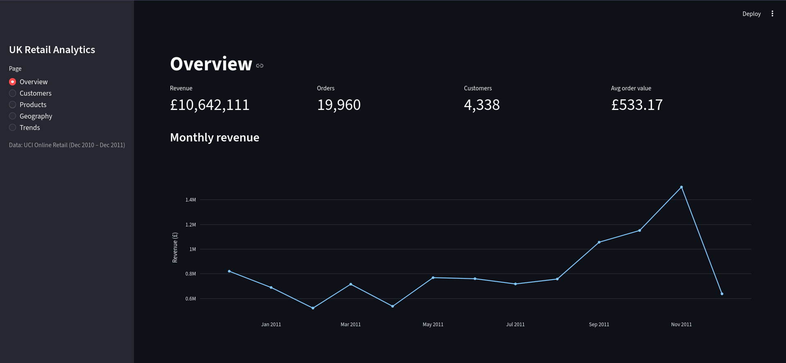
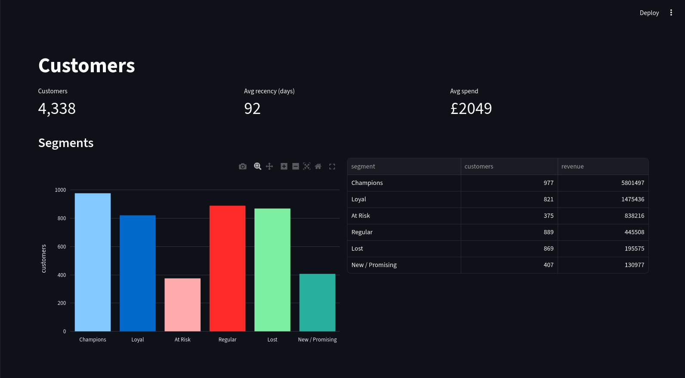
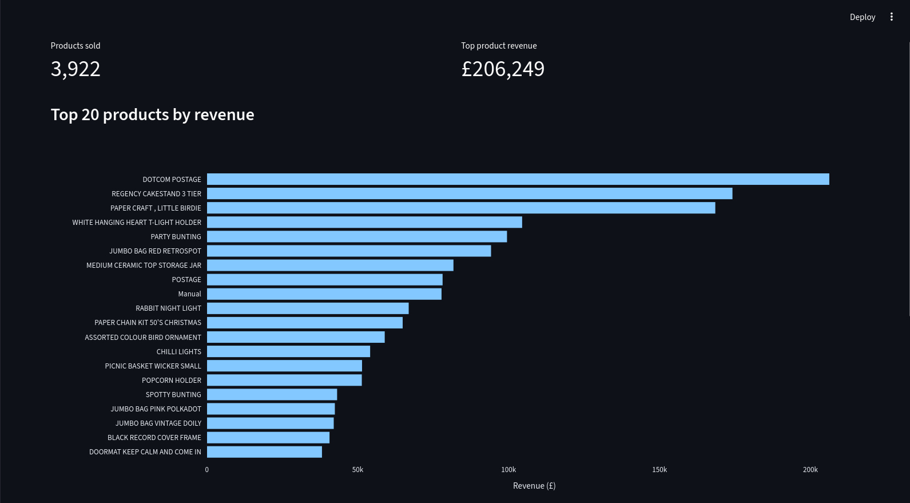
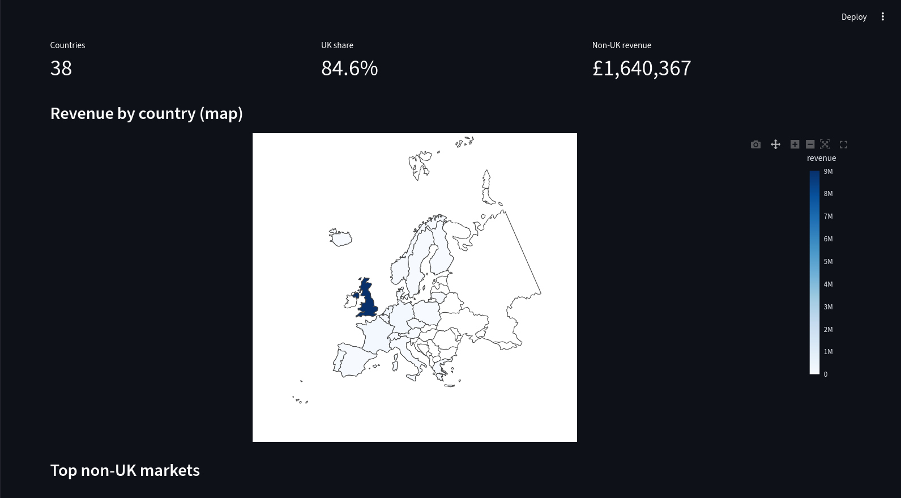
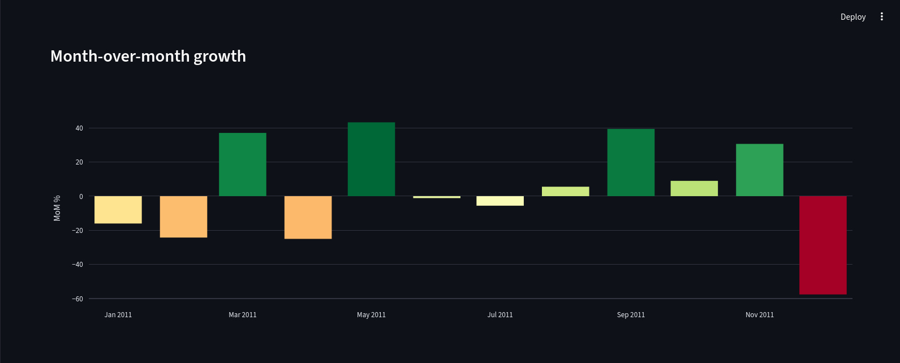

# uk-retail-analytics

Small analytics project on the UK Online Retail dataset. SQL on PostgreSQL with a Streamlit dashboard on top.

I wanted to practice SQL on a real dataset and try out Streamlit, so I picked this one and built the whole pipeline from raw Excel to dashboard.

## Preview







## Project structure

```
.
├── data/           # dataset notes, raw file not committed
├── database/       # schema, views, ETL script
├── queries/        # analytical SQL grouped by topic
├── dashboard/      # Streamlit app
├── docs/           # ER diagram + screenshots
├── requirements.txt
└── README.md
```

## Dataset

UK Online Retail from the UCI ML Repository. About 540k transactions, Dec 2010 to Dec 2011, mostly UK with some EU customers. Column-level notes and known issues are in `data/README.md`.

## Database

Five tables:

* `countries` lookup
* `customers` one row per CustomerID, with main country
* `products` one row per StockCode
* `invoices` invoice header, cancellation flag, customer, country
* `invoice_items` line items

ER diagram is in `docs/er_diagram.md` (Mermaid, renders on GitHub).

## How to run

```bash
# 1. Get the data
mkdir -p data
curl -L -o data/online_retail.xlsx \
  "https://archive.ics.uci.edu/ml/machine-learning-databases/00352/Online%20Retail.xlsx"

# 2. Create the database
createdb uk_retail
psql uk_retail -f database/schema.sql

# 3. Install deps and load
pip install -r requirements.txt
cp .env.example .env   # fill in your DB credentials
python database/load_data.py

# 4. Create views
psql uk_retail -f database/views.sql

# 5. Run the dashboard
streamlit run dashboard/app.py
```

## SQL queries

Each file in `queries/` has a few standalone queries. Run them in psql or any client.

* `01_customers.sql` top customers, RFM scores, segments, one-time vs repeat, cohort retention
* `02_products.sql` bestsellers by revenue and units, slow movers, return rate, frequently bought together
* `03_sales_trends.sql` monthly, weekday, hourly revenue, day-hour heatmap, MoM growth
* `04_geography.sql` revenue per country, non-UK markets, AOV per country, country share
* `05_operations.sql` AOV, cancellation rate, basket size, peak hours

## Dashboard

Streamlit app with five pages:

* **Overview** total revenue, orders, customers, AOV, monthly trend, top countries
* **Customers** RFM segmentation, segment breakdown, RFM scatter, top spenders
* **Products** top products by revenue, slow movers
* **Geography** Europe choropleth, top non-UK markets, full country table
* **Trends** MoM growth, day-of-week x hour heatmap, cancellation rate over time

Charts are Plotly, data comes from the views in `database/views.sql`.

## Notes

A few things I bumped into:

* About 25% of source rows have no `CustomerID`. Those orders stay in `invoices` but can't appear in customer-level analysis (RFM etc.).
* Cancellations live in the same `invoices` table flagged by `is_cancellation`. Negative quantities are kept on the line items.
* The dataset covers ~13 months, so cohort analysis only really shows one yearly cycle.
* ~85% of revenue is from the UK, so non-UK charts use a separate filter to actually be readable.

## Possible improvements

* More predictive stuff (simple forecast on monthly revenue, customer churn probability)
* Filters on the dashboard (date range, country)
* Containerize with Docker so anyone can spin it up locally

## Stack

PostgreSQL, Python (pandas, psycopg2, SQLAlchemy), Streamlit, Plotly
