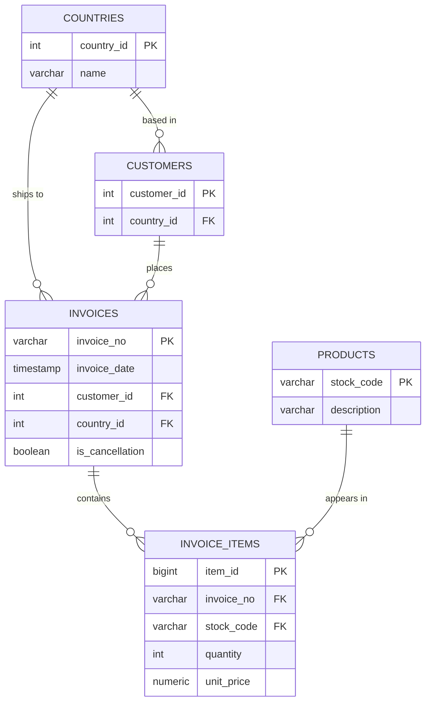

# UK Retail Analytics

SQL analysis of one year of sales from a UK online shop. I moved the flat source file into a
five-table PostgreSQL schema, wrote the analysis as SQL queries and built a Streamlit
dashboard on top of database views.


## Data

The [Online Retail dataset](https://archive.ics.uci.edu/dataset/352/online+retail) from the UCI
Machine Learning Repository (Chen, 2015, CC BY 4.0). It holds every sale of a UK online shop
from 1 December 2010 to 9 December 2011. The shop mainly sells gifts, and many of its
customers are wholesalers. The source is one Excel sheet with 541,909 rows and 8 columns. It
is not in the repository. Notes on each column are in [data/README.md](data/README.md).

## Database



| Table | Rows | Contents |
|---|---|---|
| `countries` | 38 | Country names |
| `customers` | 4,371 | One row per customer ID, with the customer's main country |
| `products` | 3,938 | One row per stock code, with its description |
| `invoices` | 23,796 | Date, customer and country of each invoice, and whether it is a cancellation |
| `invoice_items` | 534,129 | Product, quantity and unit price of each invoice line |

`database/schema.sql` creates the tables. Foreign keys connect them, a CHECK constraint keeps
unit prices from going below zero, and four indexes cover the columns the queries join and
filter on: the invoice date, the customer, the invoice number and the stock code.

## Loading

`database/load_data.py` reads the Excel file with pandas, cleans it and inserts the rows
with psycopg2 in batches.

| Step | Rows |
|---|---|
| Rows in the source file | 541,909 |
| No description, or a price of zero or less | 2,517 removed |
| Exact duplicates | 5,263 removed |
| Loaded into `invoice_items` | 534,129 |

An invoice number that starts with C marks a cancellation. Cancellations stay in `invoices`
with `is_cancellation` set, and their lines keep the negative quantities. A quarter of the
rows have no customer ID. Their invoices are loaded with an empty `customer_id`, so they
count in revenue but not in the customer analysis.

Some codes are not consistent in the source. 217 stock codes appear with more than one
description, and each product gets its most common one. 8 customers appear with more than
one country, and each customer gets the country on most of their rows.

## Analysis

The SQL in `queries/` answers questions grouped by topic.

| File | Questions |
|---|---|
| `01_customers.sql` | Top 20 customers, RFM scores and segments, one-time against repeat customers, cohort retention |
| `02_products.sql` | Best sellers by revenue and by units, slow movers, return rate per product, products bought together |
| `03_sales_trends.sql` | Revenue by month, weekday and hour, orders by weekday and hour, month-over-month growth |
| `04_geography.sql` | Revenue per country, the top markets outside the UK, average order value per country, each country's share of revenue |
| `05_operations.sql` | Average and median order value, cancellation rate per month, basket size, the busiest hours |

RFM ranks each customer by recency, frequency and spend. `NTILE(5)` splits each measure into
five groups, and a `CASE` expression turns the three scores into segments such as Champions,
Loyal and At Risk. The cohort query groups customers by the month of their first purchase
and counts how many of them buy again in each later month.

The queries use CTEs, the window functions `NTILE`, `LAG` and `SUM() OVER ()`,
`PERCENTILE_CONT` for the median, `FILTER` for conditional counts, and a self-join on
invoice lines to find products bought together.

## Dashboard

`dashboard/app.py` is a Streamlit app with five pages. The charts are Plotly. Query results
are cached for an hour.

| Page | Content |
|---|---|
| [Overview](docs/screenshots/01_overview.jpg) | Revenue, orders, customers and average order value, monthly revenue, the top five countries |
| [Customers](docs/screenshots/02_customers.jpg) | RFM segments with customers and revenue, recency against spend for every customer, the top 10 customers |
| [Products](docs/screenshots/03_products.jpg) | The top 20 products by revenue, slow movers with fewer than 10 units sold |
| [Geography](docs/screenshots/04_geography.jpg) | Revenue on a map of Europe, the top 15 markets outside the UK, a table of all countries |
| [Trends](docs/screenshots/05_trends.jpg) | Month-over-month growth, orders by weekday and hour, cancellation rate per month |

Most pages read from the views in `database/views.sql`, which hold the joins and sums that
several pages share.

| View | Contents |
|---|---|
| `v_order_totals` | One row per invoice that is not a cancellation, with its total |
| `v_monthly_revenue` | Orders and revenue per month |
| `v_country_revenue` | Orders, customers and revenue per country |
| `v_product_performance` | Units sold and revenue per product |
| `v_customer_rfm` | Recency, frequency and spend per customer |

Revenue is quantity times unit price, summed over the invoices that are not cancellations.
The data ends on 9 December 2011, so December 2011 is a partial month. The United Kingdom
brings 85% of the revenue, so the Geography page shows the other markets in a separate chart.

## Built with

PostgreSQL for the database and SQL. Python for the rest: pandas, openpyxl and psycopg2 in
the loader, and Streamlit, Plotly and SQLAlchemy in the dashboard.

## Run locally

With PostgreSQL and Python 3.10 or newer:

1. Download the source file into `data/`:
   ```bash
   curl -L -o data/online_retail.xlsx \
     "https://archive.ics.uci.edu/ml/machine-learning-databases/00352/Online%20Retail.xlsx"
   ```
2. Create the database and the tables with `createdb uk_retail` and
   `psql uk_retail -f database/schema.sql`.
3. Install the packages with `pip install -r requirements.txt`. Copy `.env.example` to `.env`
   and fill in the connection settings.
4. Load the data with `python database/load_data.py`, then create the views with
   `psql uk_retail -f database/views.sql`.
5. Start the dashboard with `streamlit run dashboard/app.py`. It opens on
   `http://localhost:8501`.

## License

MIT, see [LICENSE](LICENSE).
