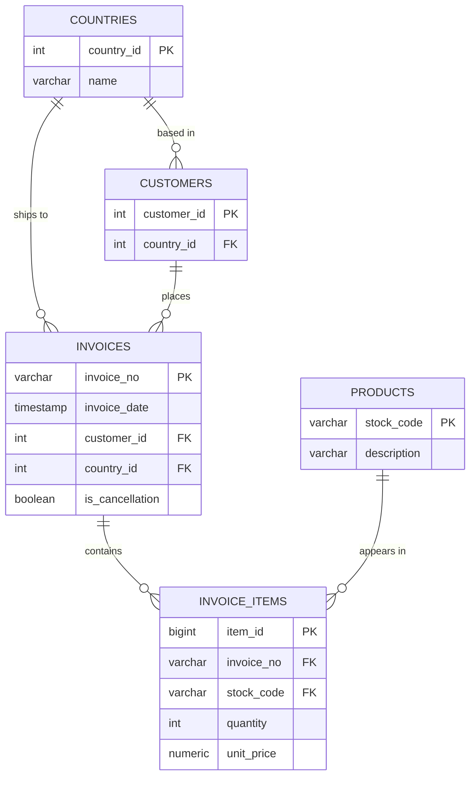

# ER diagram

## Notes

- `customer_id` on `invoices` is nullable — about 25% of source rows have no CustomerID.
- `country_id` is stored on both `customers` and `invoices`. Customer country is their main country (most frequent), invoice country is where that specific order shipped to.
- Cancellations stay in the same `invoices` table, marked by `is_cancellation`. Their line items can have negative quantities.
